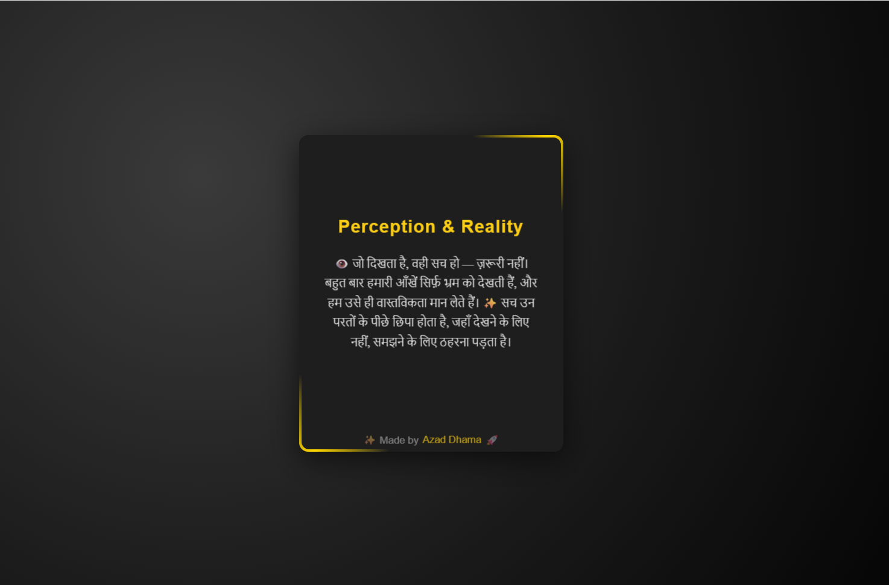

# Depth Card

**Where perception meets motion.**

An interactive 3D card showcasing tilt mechanics, depth-based parallax, dynamic lighting, and physics-driven shadows — built using pure CSS and JavaScript.

---

## 🖼️ Preview

---

## ✨ Features

* 3D tilt interaction (mouse-based)
* Multi-layer depth (parallax illusion)
* Dynamic light reflection
* Physics-based shadow system
* Animated conic-gradient border
* Smooth performance using `requestAnimationFrame`

---

## 🚀 Live Preview

[

---

## ⚙️ Tech Stack

HTML • CSS • Vanilla JavaScript

---

## 🚀 Getting Started

1. Clone the repository
2. Open `index.html` in your browser
3. Move your cursor over the card to experience the interaction

---

## 📌 Note

This project focuses on **UI physics and interaction design**, demonstrating how motion, light, and depth can enhance user experience.

---

## 👤 Author

✨ Made by **Azad Dhama**
